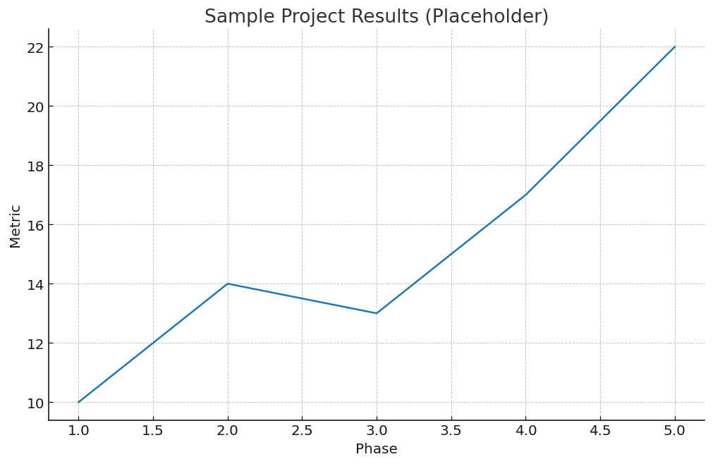

# Projects and Case Studies

**How to read:** Each case lists *context*, *actions* and *results* with links to proof (decks/dashboards/models).

## P1: Alpha Construction Marketing Strategy Enhancement Initiative
- **Context:** Regional general contractor seeking to increase qualified inbound leads from homeowners and small commercial clients; existing digital spend produced low conversion and inconsistent follow-up.
- **Actions:** Full-funnel audit (SEO/SEM/social/landing pages) keyword and audience refinement, message testing and landing page rebuild. Implemented GA4 + UTM hygiene, lead-scoring rules in CRM, and a structured nurture sequence (email + call cadence). Ran A/B tests on headline, CTA and form length, set weekly KPI reviews.
- **Results:** {Add metrics: e.g., **+X% CTR**, **–Y% CPL**, **+Z pp** lead-to-opportunity conversion within N weeks.}
- **Artifacts:** [Campaign plan](#){target="_blank"} · [Funnel dashboard](#){target="_blank"} · [Landing page mockups](#){target="_blank"}

## P2: DairyFresh Transportation Case Logistics Strategy for Canadian Milk Distribution
- **Context:** DairyFresh Inc. ships temperature-controlled milk across Canadian regions under strict freshness SLAs rising fuel costs and empty backhauls increased per-litre distribution costs.
- **Actions:** Built a network model with facility–store flows, vehicle capacities and delivery time windows evaluated hub-and-spoke vs. direct-ship scenarios. Applied route optimization to minimize distance and late deliveries analyzed backhaul pairings and load consolidation created a dispatch playbook and KPI pack (OTD, km/stop, cost/litre).
- **Results:** {Add metrics: e.g., **–X% total transport cost**, **–Y% empty kilometres**, **+Z pp** on-time delivery.}
- **Artifacts:** [Optimization model](#){target="_blank"} · [Scenario comparison sheet](#){target="_blank"} · [Route maps](#){target="_blank"}

## Visual Evidence
{fig-alt="Placeholder chart illustrating improved performance across project phases" width="800"}
